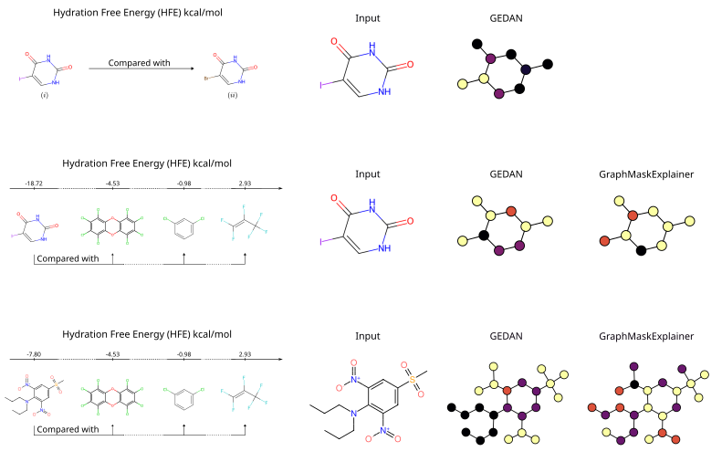

# GEDAN: Learning the Edit Costs for Graph Edit Distance

This repository contains the code for the anonymous submission **"GEDAN: Learning the Edit Costs for Graph Edit Distance"**. The project introduces an interpretable GNN framework for approximating Graph Edit Distance (GED) through context-aware edit cost learning, applicable in both supervised and unsupervised settings, and effective for molecular analysis.

---

## Visual Comparison Example

The figure below shows an example of molecular analysis generated by GEDAN. Lighter colors indicate high relevance, while darker colors represent low or no relevance.



To reproduce the image, use the following commands:

```bash
python script_Mol.py --input 2 --target 3
python script_Mol.py --input 2 --target all
python script_Mol.py --input 61 --target all
```

Other comparisons can be made by providing the indices of the molecules located in the *molecules* folder.

---

## How to Use GEDAN

### Installation

This project requires Python 3.11. Follow the steps below to set up your environment and install the necessary dependencies.

#### 1) Clone the repository and set up a virtual environment:

```bash
python3.11 -m venv myenv
source myenv/bin/activate 
pip install -r requirements.txt
```

#### 2) Install PyTorch (CPU version by default):

```bash
pip install torch==2.2.0 torchvision==0.17.0 torchaudio==2.2.0
```
**Note for GPU users**: The requirements.txt file includes the CPU versions of PyTorch (torch, torchvision, torchaudio), which are sufficient for running molecular prediction on the FreeSolv dataset. If you wish to use GPU acceleration, please uninstall these packages and install the appropriate CUDA-enabled versions manually (see instructions below).

#### 3) GPU Acceleration (Optional)

If you have an NVIDIA GPU and want to take advantage of CUDA acceleration, you must install the PyTorch version that matches your CUDA installation. Visit the official [PyTorch installation page](https://pytorch.org/get-started/locally/) to find the correct command for your system and CUDA version.


### Training

The following commands can be used to train models for the Edit Cost (EC) and Graph Edit Distance (GED) tasks:

#### Edit Cost (EC) task
```bash
python scripts/train.py --type EC --dataset <DATASET>
```
Where:
- `<DATASET>` can be: `BBBP`, `FreeSolv`, or `ZINC`.

#### Graph Edit Distance (GED) task
```bash
python scripts/train.py --type GED --dataset <DATASET> --model <MODEL> [--idx_costs <INDEX>]
```
Where:
- `<DATASET>` can be: `AIDS`, `MUTAG`, or `PTC_MR`.
- `<MODEL>` can be: `UGEDAN` or `SGEDAN`.
- `[--idx_costs]` is optional and accepts integer values from `0` to `4`.

---

## How to Verify Results

### GED results
To verify the GED results, use:

```bash
python script_GED.py --dataset <DATASET> --model <TYPE>
```
Where:
- `<DATASET>` can be: `AIDS`, `MUTAG`, or `PTC_MR`.
- `<TYPE>` can be: `U` for UGEDAN or `S` for SGEDAN.

Example:
```bash
python script_GED.py --dataset MUTAG --model S
```

### EC results
To verify the EC results, use:

```bash
python script_EC.py --dataset <DATASET>
```
Where:
- `<DATASET>` can be: `BBBP`, `FreeSolv`, or `ZINC`.

Example:
```bash
python script_EC.py --dataset FreeSolv
```

---

**Note**: This repository is anonymous and intended solely for peer review purposes. No author-identifying information is included, in accordance with the double-blind review policy.
